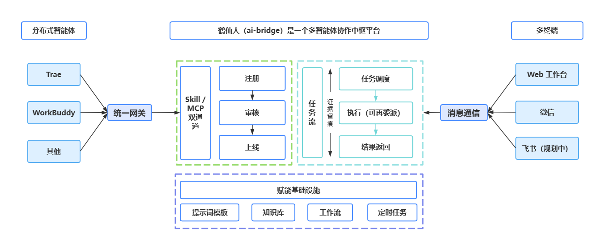

# 鹤仙人 (ai-bridge) v7.0.0

<p align="center">
  
</p>

[](https://gitee.com/yzj1/ai-bridge/releases/v7.0.0)
[](https://nodejs.org)
[](./LICENSE)
[](./docker-compose.yml)

> 鹤仙人 ai-bridge 是多智能体协作中枢。把分布在多台主机、不同形态的 AI 智能体（Trae / Qcody / Claude Code / Cursor 等）统一接入一个平台，通过任务队列、委派链、会话、工作流、定时规则与模拟微信通道进行编排与协作。

- **用户侧**：Web 控制台、聊天会话、模拟微信消息都可以创建任务。
- **平台侧**：负责任务三级路由（target → capability → general）、委派链、证据留痕、知识库与模型配置。
- **智能体侧**：Agent 通过 **Skill 自动通道** 或 **MCP 会话通道** 两种模式接入，长轮询领任务、提交结果与证据。

零构建步骤、原生 ESM、前端无框架/CDN，唯一运行时依赖 `express`，持久化为 append-only JSONL 事件流。


---
## 系统架构



---

## 界面预览

前端为 hash 路由 SPA，左侧侧边栏导航，右侧内容区动态渲染。

| 页面 | 路由 | 说明 |
| --- | --- | --- |
| 概览 | `#/overview` | 今日任务、成功率、Agent 在线、队列深度、7 天趋势、周报入口 |
| 任务中心 | `#/tasks` | 全部任务 / 定时任务，筛选、详情抽屉、重试改派 |
| 对话 | `#/chat` | 会话三栏，发送即创建 chat 任务，支持 `@agent` 指派 |
| 智能体 | `#/agents` | 智能体列表（presence 徽章、审核、token 重置）/ 能力仓库（技能 + MCP 服务）/ 接入智能体（skill 文档、MCP 配置） |
| 知识库 | `#/kb` | 知识条目 / 知识图谱 / 提示词 / 导入 |
| 工作流 | `#/workflows` | 模板 / 执行记录 |
| 消息通信 | `#/claw` | 连接 / 联系人 / 推送订阅 / 消息记录 |
| 设置 | `#/settings` | AI 模型 / 用户管理 / 系统 / 日志 |

> 截图资源目录为 `docs/imges/`，包含 `ai-bridge.png`（架构图）、`logo.jpg`、`logo1.png`、`logo2.png`；如需界面截图请自行补充到该目录并在本处引用。

---

## 核心特性

- **Agent 注册中心与审核门控**
  Agent 自助注册后进入 `pending_review`，管理员在「智能体」页通过/拒绝/禁用；`token` 注册时明文返回一次，后台支持重置。

- **双通道接入**
  **Skill 通道**：常驻自动型 agent，心跳保活，长轮询 `GET /api/task/poll` 自动领任务。
  **MCP 通道**：会话驱动型，通过 `POST /mcp` JSON-RPC 在 Claude Code / Cursor / Trae 中暴露 `bridge_*` 工具。

- **能力仓库（技能 + MCP 服务）**
  内置 6 个技能（shell-executor / web-searcher / code-reviewer / port-scanner / doc-writer / kb-curator）和 4 个 MCP 服务（filesystem / brave-search / git / sqlite），首次访问自动播种。管理员可新建自定义技能或 MCP 服务、把技能安装到指定智能体（`installed_skills` + `install_count` 联动）、一键生成 `mcp_config`、对 MCP 配置做静态安全审查（密钥 / 危险命令 / 路径覆盖），审查状态分为 `passed / warning / blocked`。

- **任务三级路由**
  派发优先级：指定 `target_agent` > 匹配 `required_capability` > 通用任务；支持定向派发验证与委派子任务。

- **执行证据留痕**
  Agent 提交结果时携带 `evidence`：执行命令、读取文件、检索记录、工具调用、关键推理，前端任务详情可折叠查看。

- **多源任务入口**
  手动创建、聊天会话 `@agent`、工作流步骤、定时规则触发、模拟微信 incoming。

- **知识库赋能**
  分类/条目/关联链接、关键词搜索、长文档分块、任务结果回流为条目、agent 凭证检索与 MCP 检索。

- **工作流编排**
  定义带依赖的步骤，支持变量渲染、循环依赖校验、执行记录追踪。

- **模拟微信通信**
  通过 `ILINK_MOCK=1` 启用 mock 模式，支持扫码登录、联系人、消息记录、推送规则与 outbox，便于没有真实 iLink 硬件时的开发调试。

- **AI 模型配置**
  模型用途绑定（chat/router/report/...）、上下文压缩摘要、周报自动生成与润色。

---

## 快速开始

### 方式一：Docker Compose（推荐）

```bash
git clone https://gitee.com/yzj1/ai-bridge.git
cd ai-bridge
# 复制环境变量示例并编辑（可选，默认 PORT=4567）
cp .env.example .env
# 启动（首次会自动构建镜像）
docker compose up -d --build
```

访问 http://localhost:4567，默认管理员账号 `admin` / `admin123`（首次启动自动播种，请尽快修改）。

`docker-compose.yml` 实际内容：

```yaml
services:
  ai-bridge:
    build: .
    ports:
      - "4567:4567"
    environment:
      PORT: 4567
      AIBRIDGE_DATA_DIR: /app/data
    volumes:
      - ./data:/app/data
    restart: unless-stopped
```

### 方式二：本地 Node.js

```bash
# 克隆
git clone https://gitee.com/yzj1/ai-bridge.git
cd ai-bridge

# 安装依赖（需要 Node.js >= 20）
npm install --no-bin-links

# 启动
cp .env.example .env   # 可选
npm start              # node src/index.js
```

默认端口 `4567`，启动后访问：http://localhost:4567 。

---


## 目录结构

```
ai-bridge/
├── data/                      # 运行时数据（jsonl 事件流，.gitignore）
├── docs/
│   ├── ai-bridge.skill.md     # Agent Skill 接入规范文档
│   └── imges/                 # 项目图片资源
├── public/                    # 原生前端（hash 路由 SPA）
│   ├── index.html             # 应用挂载点
│   ├── login.html             # 登录页
│   ├── style.css              # 全局样式
│   ├── js/
│   │   ├── api.js             # 公共 API 封装、通知、工具函数
│   │   ├── main.js            # SPA 路由与初始化
│   │   ├── nav.js             # 侧边栏菜单配置
│   │   ├── workflow-canvas.js # 工作流画布
│   │   └── pages/             # 各页面模块
│   │       ├── overview.js    # 概览页
│   │       ├── tasks.js       # 任务中心
│   │       ├── chat.js        # 对话页
│   │       ├── agents.js      # 智能体页
│   │       ├── kb.js          # 知识库页
│   │       ├── workflows.js   # 工作流页
│   │       ├── claw.js        # 消息通信页
│   │       └── settings.js    # 设置页
│   └── img/                   # 前端图标资源
├── scripts/
│   ├── smoke.sh               # 端到端冒烟测试
│   └── test-*.mjs / debug*.sh # 调试与测试脚本
├── src/
│   ├── index.js               # 入口：loadAll → initAuth → createServer → listen → 调度器 tick
│   ├── server.js              # Express 装配与路由挂载
│   ├── storage.js             # JSONL append-only 存储 + 内存索引 + settings + 日志
│   ├── auth.js                # JWT / PBKDF2 / requireUser / requireAdmin / requireAgent
│   ├── ai.js                  # AI 模型调用与配置
│   ├── ai-chat.js             # 聊天 AI 路由与上下文压缩
│   ├── util.js                # 通用工具函数
│   ├── lib/
│   │   └── users.js           # 用户数据管理
│   ├── claw/                  # iLink 适配器与凭证管理
│   │   ├── ilink-adapter.js   # iLink 协议适配
│   │   ├── index.js           # adapter 生命周期管理
│   │   ├── secrets.js         # 凭证读写
│   │   ├── dedup.js           # 消息去重
│   │   └── ilink/             # iLink 协议辅助模块
│   └── routes/                # 功能路由模块
│       ├── agents.js          # Agent 注册、心跳、CRUD、审核、token 重置、install-skill
│       ├── tasks.js           # 任务队列、长轮询、完成、重试、改派、统计
│       ├── mcp.js             # MCP JSON-RPC 2.0 端点与 bridge_* tools
│       ├── skills.js          # 技能仓库：CRUD / 文档 / 内置播种
│       ├── mcp-registry.js    # MCP 服务仓库：CRUD / 安全审查 / mcp_config 生成
│       ├── sessions.js        # 会话 CRUD
│       ├── chat.js            # 聊天即任务、AI 路由、上下文压缩
│       ├── kb.js              # 知识库分类/条目/链接/搜索/分块
│       ├── prompts.js         # 提示词模板
│       ├── workflows.js       # 工作流定义与执行
│       ├── schedules.js       # 定时规则与触发
│       ├── claw.js            # 模拟微信 / iLink 通信
│       ├── overview.js        # 总览 KPI 与周报
│       └── settings.js        # AI 模型、用户、系统信息、日志
├── Dockerfile                 # node:20-alpine 镜像
├── docker-compose.yml         # Docker Compose 配置
├── .env.example               # 环境变量示例
└── package.json               # 项目元数据
```

---

## API 概览

### 认证与全局

| 方法 | 路径 | 权限 | 说明 |
| --- | --- | --- | --- |
| GET | `/health` | 开放 | 健康检查 |
| POST | `/api/auth/login` | 开放 | 用户登录，返回 JWT |
| GET | `/api/system/skill` | 用户 | 返回 `docs/ai-bridge.skill.md` 内容 |
| GET | `/` | 开放 | 返回 `public/index.html` |

### Agent 管理

| 方法 | 路径 | 权限 | 说明 |
| --- | --- | --- | --- |
| POST | `/api/agent/register` | 开放 | Agent 自助注册（限流） |
| GET | `/api/heartbeat` | Agent | 心跳上报，刷新在线状态 |
| GET | `/api/agents` | 用户 | 列出所有 Agent（含实时 presence） |
| POST | `/api/agents` | 管理员 | 预创建 MCP Agent，直接 active |
| PATCH | `/api/agents/:id` | 管理员 | 审核、启用/禁用、修改名称/能力 |
| POST | `/api/agents/:id/token/reset` | 管理员 | 重置 Agent token |
| POST | `/api/agents/:id/install-skill` | 管理员 | 为 Agent 安装技能（写入 `installed_skills`，`install_count` +1） |
| DELETE | `/api/agents/:id/install-skill/:skill_id` | 管理员 | 卸载 Agent 的技能（`install_count` -1，不低于 0） |
| DELETE | `/api/agents/:id` | 管理员 | 删除 Agent |

### 能力仓库 — 技能

| 方法 | 路径 | 权限 | 说明 |
| --- | --- | --- | --- |
| GET | `/api/skills` | 用户 | 列出全部技能（内置在前），支持 `?category=` 过滤 |
| GET | `/api/skills/categories` | 用户 | 技能分类列表 |
| GET | `/api/skills/:id` | 用户 | 技能详情 |
| GET | `/api/skills/:id/doc` | 用户 | 仅返回技能接入文档（`skill_doc` + `config_example`） |
| POST | `/api/skills` | 管理员 | 新建自定义技能（`name` 唯一，重复 409） |
| PATCH | `/api/skills/:id` | 管理员 | 编辑技能（修改后 `updated_at` 刷新） |
| DELETE | `/api/skills/:id` | 管理员 | 删除自定义技能（内置 403） |

### 能力仓库 — MCP 服务

| 方法 | 路径 | 权限 | 说明 |
| --- | --- | --- | --- |
| GET | `/api/mcp-registry` | 用户 | 列出全部 MCP 服务，支持 `?category=` / `?transport=` 过滤 |
| GET | `/api/mcp-registry/categories` | 用户 | MCP 服务分类列表 |
| GET | `/api/mcp-registry/:id` | 用户 | MCP 服务详情 |
| GET | `/api/mcp-registry/:id/config` | 用户 | 生成 `mcpServers` JSON（含 `tools` 与 `security_review`） |
| POST | `/api/mcp-registry` | 管理员 | 新建自定义 MCP 服务（自动触发静态安全审查） |
| PATCH | `/api/mcp-registry/:id` | 管理员 | 编辑 MCP 服务（配置字段变更后自动重审） |
| POST | `/api/mcp-registry/:id/review` | 管理员 | 手动触发静态安全审查 |
| DELETE | `/api/mcp-registry/:id` | 管理员 | 删除自定义 MCP 服务（内置 403） |

### 任务

| 方法 | 路径 | 权限 | 说明 |
| --- | --- | --- | --- |
| GET | `/api/task/poll` | Agent | 长轮询领取一个 pending 任务 |
| POST | `/api/task/progress` | Agent | 上报任务中间进展 |
| POST | `/api/task/complete` | Agent | 汇报任务完成或失败 |
| GET | `/api/tasks/stats` | 用户 | 任务状态统计 |
| GET | `/api/tasks` | 用户 | 列出任务，支持多种过滤 |
| GET | `/api/tasks/:id` | 用户 | 单个任务详情（含子任务） |
| POST | `/api/tasks` | 用户 / Agent | 创建新任务 |
| POST | `/api/tasks/:id/retry` | 用户 | 重试任务 |
| POST | `/api/tasks/:id/reassign` | 用户 | 改派任务 |
| DELETE | `/api/tasks/:id` | 用户 | 删除任务 |

### MCP JSON-RPC

| 方法 | 路径 | 权限 | 说明 |
| --- | --- | --- | --- |
| POST | `/mcp` | 按 tool | MCP JSON-RPC 2.0 入口 |

`tools/call` 暴露的工具：

| Tool | 权限 | 说明 |
| --- | --- | --- |
| `bridge_register` | 开放（限流） | MCP 方式注册 Agent |
| `bridge_heartbeat` | Agent active | 上报心跳 |
| `bridge_poll_task` | Agent active | 短轮询领取任务 |
| `bridge_complete_task` | Agent active | 汇报任务完成/失败 |
| `bridge_create_task` | Agent active | 创建委派子任务 |
| `bridge_task_status` | Agent active | 查询任务状态与结果 |
| `bridge_kb_search` | Agent active | 检索知识库 |

### 会话

| 方法 | 路径 | 权限 | 说明 |
| --- | --- | --- | --- |
| GET | `/api/sessions` | 用户 | 列出会话 |
| POST | `/api/sessions` | 用户 | 创建会话 |
| PATCH | `/api/sessions/:id` | 用户 | 更新会话名称/状态 |
| DELETE | `/api/sessions/:id` | 用户 | 删除会话 |

### 聊天

| 方法 | 路径 | 权限 | 说明 |
| --- | --- | --- | --- |
| POST | `/api/chat` | 用户 | 聊天创建任务，支持 `@agent` 指派 |
| POST | `/api/chat/:sessionId/messages` | 用户 | 插入系统备注/虚拟消息 |
| POST | `/api/chat/retry` | 用户 | 重新创建聊天任务 |
| POST | `/api/chat/reassign` | 用户 | 改派聊天任务 |
| GET | `/api/chat/:sessionId/messages` | 用户 | 获取会话消息/任务列表 |

### 知识库

| 方法 | 路径 | 权限 | 说明 |
| --- | --- | --- | --- |
| GET | `/api/kb` | 用户 | 列出全部分类、条目、关系链接 |
| POST | `/api/kb/categories` | 用户 | 新建分类 |
| PATCH | `/api/kb/categories/:id` | 用户 | 修改分类 |
| DELETE | `/api/kb/categories/:id` | 用户 | 删除分类（级联） |
| POST | `/api/kb/items` | 用户 | 新建条目（自动分块） |
| PATCH | `/api/kb/items/:id` | 用户 | 更新条目 |
| DELETE | `/api/kb/items/:id` | 用户 | 删除条目 |
| POST | `/api/kb/links` | 用户 | 创建条目关联 |
| PATCH | `/api/kb/links/:id` | 用户 | 更新链接 |
| DELETE | `/api/kb/links/:id` | 用户 | 删除链接 |
| GET | `/api/kb/search` | 用户 / Agent | 关键词搜索 |
| POST | `/api/kb/search` | 用户 / Agent | 兼容旧版的 POST 搜索 |
| POST | `/api/kb/items/:id/import-file` | 用户 | 导入文件到条目 |
| POST | `/api/kb/from-task` | 用户 | 将任务结果回流为知识条目 |

### 提示词

| 方法 | 路径 | 权限 | 说明 |
| --- | --- | --- | --- |
| GET | `/api/prompts` | 用户 | 列出模板 |
| POST | `/api/prompts` | 用户 | 新建模板 |
| PATCH | `/api/prompts/:id` | 用户 | 更新模板 |
| DELETE | `/api/prompts/:id` | 用户 | 删除模板 |
| POST | `/api/prompts/:id/apply` | 用户 | 渲染模板 |
| POST | `/api/prompts/:id/use` | 用户 | 渲染并创建生成任务 |

### 工作流

| 方法 | 路径 | 权限 | 说明 |
| --- | --- | --- | --- |
| GET | `/api/workflows` | 用户 | 列出定义 |
| POST | `/api/workflows` | 用户 | 新建工作流 |
| GET | `/api/workflows/:id` | 用户 | 获取定义 |
| PATCH | `/api/workflows/:id` | 用户 | 更新定义 |
| DELETE | `/api/workflows/:id` | 用户 | 删除工作流 |
| POST | `/api/workflows/:id/execute` | 用户 | 启动执行 |
| GET | `/api/workflows/runs` | 用户 | 列出执行记录 |
| GET | `/api/workflows/runs/:id` | 用户 | 单次执行详情 |

### 定时规则

| 方法 | 路径 | 权限 | 说明 |
| --- | --- | --- | --- |
| GET | `/api/schedules` | 用户 | 列出规则 |
| POST | `/api/schedules` | 用户 | 新建规则 |
| PATCH | `/api/schedules/:id` | 用户 | 更新规则 |
| DELETE | `/api/schedules/:id` | 用户 | 删除规则 |
| POST | `/api/schedules/:id/run-now` | 用户 | 立即触发 |

### 消息通信（模拟微信 / iLink）

| 方法 | 路径 | 权限 | 说明 |
| --- | --- | --- | --- |
| GET | `/api/claw/status` | 用户 | 连接状态 |
| POST | `/api/claw/login/start` | 用户 | 触发扫码登录（mock 可 skip） |
| POST | `/api/claw/logout` | 用户 | 退出登录 |
| POST | `/api/claw/restart` | 用户 | 重启 iLink adapter |
| POST | `/api/claw/diagnose` | 用户 | 连接诊断 |
| GET | `/api/claw/qrcode.png` | 用户 | 登录二维码图片 |
| GET | `/api/claw/qrcode-scan` | 开放 | mock 扫码回调页面 |
| GET | `/api/claw/credentials` | 管理员 | iLink 凭证状态 |
| POST | `/api/claw/credentials` | 管理员 | 写入 iLink 凭证 |
| DELETE | `/api/claw/credentials` | 管理员 | 清除 iLink 凭证 |
| GET | `/api/claw/contacts` | 用户 | 联系人列表 |
| GET | `/api/claw/contacts/groups` | 用户 | 分组统计 |
| POST | `/api/claw/contacts` | 用户 | 新增联系人 |
| PUT | `/api/claw/contacts/:id` | 用户 | 更新联系人 |
| DELETE | `/api/claw/contacts/:id` | 用户 | 删除联系人 |
| POST | `/api/claw/contacts/seed` | 用户 | 播种默认联系人 |
| GET | `/api/claw/rooms` | 用户 | 群聊列表 |
| GET | `/api/claw/messages` | 用户 | 消息历史 |
| GET | `/api/claw/messages/unread` | 用户 | 未读消息列表 |
| POST | `/api/claw/messages/:id/read` | 用户 | 标记消息已读 |
| POST | `/api/claw/send` | 用户 | 发送消息 |
| POST | `/api/claw/mock/incoming` | 用户 | 模拟收到微信消息并生成任务 |
| POST | `/api/claw/mock/connect` | 用户 | mock 模式：直接建立连接 |
| POST | `/api/claw/mock/disconnect` | 用户 | mock 模式：断开连接 |
| GET | `/api/claw/push-rules` | 用户 | 推送规则列表 |
| POST | `/api/claw/push-rules` | 用户 | 新增推送规则 |
| PATCH | `/api/claw/push-rules/:id` | 用户 | 更新规则 |
| DELETE | `/api/claw/push-rules/:id` | 用户 | 删除规则 |
| POST | `/api/claw/push-rules/:id/test` | 用户 | 测试规则 |
| GET | `/api/claw/outbox` | 用户 | 推送记录列表 |

### 总览与设置

| 方法 | 路径 | 权限 | 说明 |
| --- | --- | --- | --- |
| GET | `/api/overview` | 用户 | 总览 KPI 与趋势（含 `capabilities` 能力仓库统计） |
| GET | `/api/overview/weekly-report` | 用户 | 近 7 天周报 |
| GET | `/api/settings/ai-models` | 用户 | AI 模型配置 |
| PATCH | `/api/settings/ai-models` | 用户 | 更新模型配置 |
| GET | `/api/settings/users` | 管理员 | 列出用户 |
| POST | `/api/settings/users` | 管理员 | 创建用户 |
| PATCH | `/api/settings/users/:id` | 管理员 | 修改用户 |
| DELETE | `/api/settings/users/:id` | 管理员 | 删除用户 |
| GET | `/api/system/info` | 用户 | 系统运行信息 |
| GET | `/api/logs` | 用户 | 系统日志 |

---

## 智能体接入指南

### Skill 接入（常驻自动型）

参考完整文档：`docs/ai-bridge.skill.md`。

1. **注册**：Agent 调用 `POST /api/agent/register` 自助注册，返回 `agent_id`、`token`（`agt_` 开头）和 `review_status=pending_review`。
2. **落盘**：把凭证写入 `.ai-bridge-agent.json`（权限 600）。
3. **心跳**：每 5 秒 `GET /api/heartbeat?agent_id=...&token=...`。
4. **领任务**：长轮询 `GET /api/task/poll?agent_id=...&token=...&timeout=30`。
5. **提交结果**：`POST /api/task/complete` 带上 `result.summary` 与 `result.evidence`。
6. **审核**：管理员在 Web 控制台「智能体」页通过审核后，Agent 才能领取任务。

### MCP 接入（会话驱动型）

在支持的 MCP 客户端（Claude Code / Cursor / Trae）中添加配置：

```json
{
  "mcpServers": {
    "ai-bridge": {
      "command": "node",
      "args": ["path/to/your/bridge-mcp-server.js"],
      "env": {
        "AIBRIDGE_BASE_URL": "http://localhost:4567"
      }
    }
  }
}
```

> 当前 MCP Server 实现为 `/mcp` JSON-RPC 端点，客户端需要配套 bridge-mcp-server.js；代码仓库中如未提供该文件，请参考 `src/routes/mcp.js` 自行实现。

暴露工具：`bridge_register`、`bridge_heartbeat`、`bridge_poll_task`、`bridge_complete_task`、`bridge_create_task`、`bridge_task_status`、`bridge_kb_search`。

### curl 完整示例（Skill 通道）

```bash
BASE=http://localhost:4567

# 1. 登录获取管理员 token
TOKEN=$(curl -s "$BASE/api/auth/login" -H 'content-type: application/json' \
  -d '{"username":"admin","password":"admin123"}' | \
  node -pe 'JSON.parse(require("fs").readFileSync(0)).token')

# 2. agent 自助注册
REG=$(curl -s "$BASE/api/agent/register" -H 'content-type: application/json' \
  -d '{"name":"trae-dev","capabilities":["shell","code"],"host":"macbook-pro"}')
AGENT_ID=$(echo "$REG" | node -pe 'JSON.parse(require("fs").readFileSync(0)).agent_id')
TOKEN=$(echo "$REG" | node -pe 'JSON.parse(require("fs").readFileSync(0)).token')
echo "agent_id=$AGENT_ID token=$TOKEN"

# 3. 管理员审核通过
curl -s "$BASE/api/agents/$AGENT_ID" -H "authorization: Bearer $TOKEN" \
  -H 'content-type: application/json' -d '{"action":"approve"}'

# 4. agent 心跳
curl -s "$BASE/api/heartbeat?agent_id=$AGENT_ID&token=$TOKEN"

# 5. 用户创建任务
curl -s "$BASE/api/tasks" -H "authorization: Bearer $TOKEN" \
  -H 'content-type: application/json' \
  -d '{"content":"查询知识库中的部署规范","target_agent":"'$AGENT_ID'"}'

# 6. agent 长轮询领取任务
TASK=$(curl -s "$BASE/api/task/poll?agent_id=$AGENT_ID&token=$TOKEN&timeout=5")
TASK_ID=$(echo "$TASK" | node -pe 'JSON.parse(require("fs").readFileSync(0)).task?.id || ""')

# 7. agent 汇报结果
curl -s "$BASE/api/task/complete" -H 'content-type: application/json' -d '{
  "agent_id":"'$AGENT_ID'",
  "token":"'$TOKEN'",
  "task_id":"'$TASK_ID'",
  "status":"completed",
  "result":{
    "summary":"已找到部署规范",
    "evidence":{"executed_commands":["bridge_kb_search"],"searches":["部署规范"],"read_files":[],"tool_calls":[]}
  }
}'
```

---

## 冒烟测试

```bash
npm run smoke      # 等价于 bash scripts/smoke.sh
```

`scripts/smoke.sh` 覆盖范围（按编号）：

| 编号 | 覆盖内容 |
| --- | --- |
| 0 | 健康检查 `/health` |
| 1 | 管理员登录 |
| 2 | Agent 注册、未审核 poll 被拒、心跳放行、审核通过、列表不含 token_hash |
| 3 | 创建任务、Agent 领取、完成任务带 evidence、查询结果、任务统计 |
| 4 | 定向派发、非目标 agent 领不到、非领取者 complete 被拒 |
| 5 | MCP initialize、tools/list、无凭证调用报错、Bearer bridge_poll_task、bridge_register |
| 6 | Agent 凭证建子任务、无凭证建任务被拒、父任务 children 含子任务 |
| 7 | 工作流 CRUD/执行/循环检测/变量渲染 |
| 8 | 微信 mock + 推送规则 + incoming 生成任务 + outbox |
| 9 | 定时任务（`SMOKE_SCHEDULE=1` 时启用） |
| 10 | 周报生成 |
| 11 | AI 能力包：会话上下文压缩、智能路由、fallback、evidence 不泄露 |
| 12 | 知识库：分类/条目/搜索/MCP 搜索/分块/from-task/相似 link |
| 13 | 能力仓库：技能 CRUD / install-skill 联动 / MCP 服务 CRUD / 静态安全审查 / overview 统计 |

---

## 环境变量

`.env.example` 内容：

| 变量 | 默认值 | 说明 |
| --- | --- | --- |
| `PORT` | `4567` | HTTP 服务端口 |
| `AIBRIDGE_DATA_DIR` | `./data` | 数据目录（jsonl 事件流 + settings/secrets） |
| `ILINK_MOCK` | 未设置 | 设为 `1` 开启微信 mock 模式，无需真实 iLink 硬件 |

---

## 常见问题

### 端口被占用
```bash
lsof -ti:4567 | xargs -r kill -9
# 或换端口
PORT=5567 npm start
```

### 微信无法连接
- 检查 `/api/claw/status`
- 重新扫码：`POST /api/claw/login/start` → 打开 `/api/claw/qrcode.png`
- mock 模式：`ILINK_MOCK=1 npm start`

### 数据迁移
所有运行时数据保存在 `AIBRIDGE_DATA_DIR`（默认 `./data`）下，使用 append-only JSONL 事件流，启动时回放重建内存索引。
- 备份：`cp -r data data-backup-$(date +%Y%m%d)`
- 恢复：停止服务，替换 `data/` 目录后重启

---

## 版本历史

- **v7.0.0**：多智能体协作中枢重构 — 双通道接入（Skill / MCP）、任务三级路由、委派链、证据留痕、原生 ESM、无构建步骤
- **v6.0.0**：统一 skill 为 `ai-bridge`，明确中间程序定位
- **v5.5.5**：产品化基础：Docker 部署、统一版本号、受信代理、权限校验、依赖清理、.env.example
- **v5.0.0**：多面板工作台、知识库 2.0、工作流、微信 Claw 适配层
- **v4.0.0**：聊天即任务、evidence 协议、侧滑抽屉
- **v3.0.0**：三栏工作台、JSONL 持久化
- **v2.0.0**：心跳保活 + 长轮询、URL hash 路由
- **v1.0.0**：初始版本，基础任务队列

---

## 路线图

以下功能在代码中存在预留位置或部分实现，尚未完全落地：

- **真实微信适配器**：当前 `claw` 模块提供 iLink mock 模式与真实 iLink 启动入口，真实协议对接需外部 iLink 服务与凭证。
- **Embedding 检索**：知识库当前为关键词搜索，`kb_chunks` 集合与摘要生成逻辑已预留向量检索扩展点。
- **工作流条件分支**：当前步骤依赖为线性/并行，循环依赖已校验，条件分支与循环步骤待实现。
- **MCP 客户端示例**：`/mcp` 端点已就绪，配套 `bridge-mcp-server.js` 示例尚未入库。
- **审计与 RBAC**：已有用户管理，更细粒度的角色权限与审计日志待完善。
- **高可用 / 集群**：当前为单进程架构，未来可考虑 Redis 任务队列 + 多实例负载均衡。

---

## 贡献

欢迎 PR / Issue！

- 仓库：https://gitee.com/yzj1/ai-bridge
- 反馈：在 Gitee Issues 中提交

---

## License

[MIT](./LICENSE)
